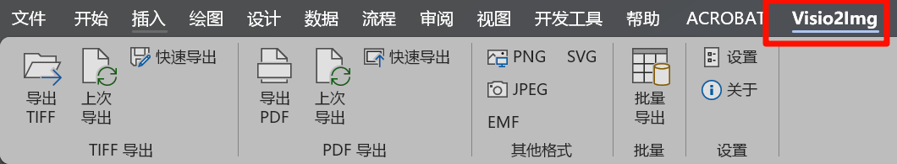
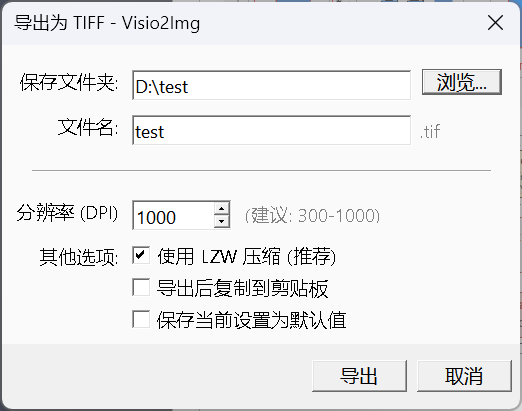
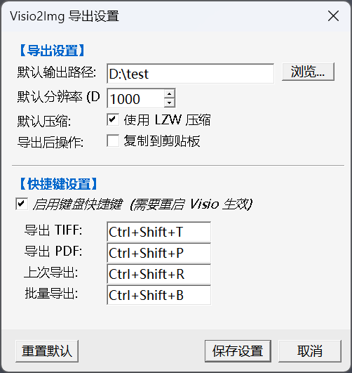
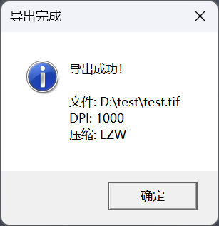
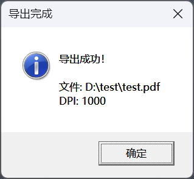
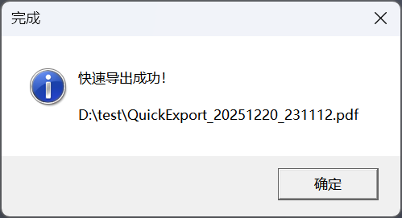
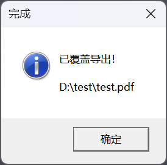
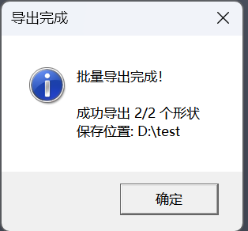

# Visio2Img

将 Microsoft Visio 选中图形导出为高质量图片的插件。

> 📦 **v1.2.0 预编译版本已发布**（2025-12-21），源代码版本整理中。  
> 下载：[Releases](https://github.com/PandaK404/Visio2Img/releases)

## 为什么开发这个插件？

在 Visio 中导出图片一直是一件令人头疼的事情：

- 每次导出都要重复 " 选择文件夹 → 输入文件名 → 选择格式 " 的繁琐操作
- 修改图形后想覆盖原文件，又要重新走一遍完整流程
- Visio 不支持直接导出为 PDF 格式
- 批量导出多个图形时，需要逐个手动操作

作为一名经常（其实也不怎么经常）需要在论文中插入 Visio 图形的用户，作者深受其苦，早就想开发一个插件来解决这些问题。奈何早年苦于不会 C# 语言，这个想法一直无法实现。近来 AI 编程助手大行其道，借助 AI 的帮助，终于将这个多年的想法变成了现实。于是便有了 **Visio2Img**，让导出图片变得简单高效。

## 功能特性

- ⚡ **快速导出**：一键使用默认设置导出，告别繁琐操作
- 🔄 **上次导出**：一键覆盖上次导出的文件，修改后无需重新选择路径
- 📦 **批量导出**：将多个选中图形分别导出为单独文件
- 🖼️ **多格式导出**：支持 TIFF、 PNG、 JPEG、 EMF、 SVG、**PDF**
- 📋 **复制到剪贴板**：导出后可选择自动复制到剪贴板
- 🎯 **选中导出**：只导出选中的图形，自动裁剪边界
- ⌨️ **快捷键支持**：可配置全局快捷键（可选）
- 💾 **记住设置**：保存导出偏好设置

## 界面预览

### Ribbon 界面

安装后，在 Visio 中会出现 **Visio2Img** 选项卡：



- **TIFF 导出**：导出 TIFF、上次导出（覆盖）、快速导出
- **PDF 导出**：导出 PDF、上次导出（覆盖）、快速导出
- **其他格式**： PNG、 JPEG、 EMF、 SVG
- **批量**：批量导出多个图形
- **设置**：设置、关于

### 导出对话框

点击 " 导出 TIFF..." 或 " 导出 PDF..." 按钮后弹出：



可以设置：
- **保存文件夹**：选择导出路径
- **文件名**：自定义文件名
- **分辨率 (DPI)**：建议 300-1000
- **其他选项**： LZW 压缩、复制到剪贴板、保存为默认值

### 设置对话框

点击 " 设置 " 按钮打开：



- **导出设置**：默认输出路径、分辨率、压缩方式、导出后操作
- **快捷键设置**：启用 / 配置全局快捷键

### 导出成功提示

#### TIFF 导出成功



#### PDF 导出成功



#### 快速导出成功



快速导出会自动在默认输出路径生成带时间戳的文件。

#### 上次导出（覆盖）成功



直接覆盖上次导出的文件，无需重新选择路径。

#### 批量导出完成



将多个选中图形分别导出为单独文件。

### 支持的导出格式

| 格式 | 扩展名 | 类型 | 特点 | 适用场景 |
|------|--------|------|------|----------|
| TIFF | `.tif` | 位图 | 支持 LZW 无损压缩，高质量 | 印刷、存档、论文插图 |
| PNG | `.png` | 位图 | 无损压缩，支持透明背景 | 网页、演示文稿 |
| JPEG | `.jpg` | 位图 | 有损压缩，文件小 | 照片类图像、网页 |
| EMF | `.emf` | 矢量 | Windows 矢量格式，无损缩放 | Office 文档、 Word 插图 |
| SVG | `.svg` | 矢量 | 开放矢量格式，可编辑 | 网页、图形设计 |
| PDF | `.pdf` | 矢量 | 通用文档格式（需 ImageMagick） | 打印、分享、存档 |

## 系统要求

### 必需
- Windows 10/11 64 位
- Microsoft Visio 2016 或更高版本（ 64 位）
- .NET Framework 4.8
- .NET SDK 6.0 或更高版本（用于编译）

### 可选
- [ImageMagick](https://imagemagick.org/script/download.php)（导出 PDF 需要）
  - 安装时请勾选 "Add application directory to your system path"

## 安装

### 1. 检查环境
```batch
check_environment.bat
```
运行此脚本检查依赖是否已安装。

### 2. 编译项目
```batch
dotnet build --configuration Release
```

### 3. 安装插件
以管理员身份运行：
```batch
install.bat
```

### 4. 验证安装
启动 Visio，应该能看到 **Visio2Img** 选项卡。

## 使用方法

### 导出 TIFF
1. 在 Visio 中选中图形
2. 点击 **Visio2Img** 选项卡 → **导出 TIFF...**
3. 设置导出参数：
   - **DPI**：分辨率（默认 1000 ）
   - **压缩**：建议使用 LZW 无损压缩
4. 选择保存位置，确认导出

### 导出 PDF
1. 在 Visio 中选中图形
2. 点击 **Visio2Img** 选项卡 → **导出 PDF...**
3. 设置参数并确认

> ⚠️ 导出 PDF 需要安装 ImageMagick

### 快速导出
- **快速导出 TIFF**：一键使用默认设置导出到默认输出路径
- **快速导出 PDF**：一键使用默认设置导出到默认输出路径

快速导出会自动在默认输出路径生成带时间戳命名的文件。

### 上次导出（覆盖）
- **上次导出 TIFF**：直接覆盖上次导出的 TIFF 文件
- **上次导出 PDF**：直接覆盖上次导出的 PDF 文件

修改图形后，一键覆盖，无需重新选择路径。

### 快捷键
1. 点击 **设置** 按钮
2. 勾选 **启用键盘快捷键**
3. 点击快捷键输入框，按下想要的快捷键组合
4. 点击 **保存设置**

默认快捷键（需先在设置中启用）：
| 功能 | 默认快捷键 |
|------|-----------|
| 导出 TIFF | Ctrl+Shift+T |
| 导出 PDF | Ctrl+Shift+P |
| 上次导出 | Ctrl+Shift+R |
| 批量导出 | Ctrl+Shift+B |

> ⚠️ 快捷键默认关闭，需要在设置中启用。请注意避免与系统或其他软件的快捷键冲突。

## 卸载

以管理员身份运行：
```batch
uninstall.bat
```

## 项目结构

```
Visio2Img/
├── Visio2Img.csproj      # 项目文件
├── Connect.cs            # COM 插件入口
├── RibbonController.cs   # Ribbon 按钮事件处理
├── ImageExporter.cs      # 图像导出核心逻辑
├── ExportDialog.cs       # 导出对话框
├── ExportSettings.cs     # 设置持久化
├── SettingsDialog.cs     # 设置对话框
├── BatchExportDialog.cs  # 批量导出对话框
├── KeyboardHook.cs       # 全局键盘钩子
├── Program.cs            # 独立测试入口
├── install.bat           # 安装脚本
├── uninstall.bat         # 卸载脚本
├── check_environment.bat # 环境检查脚本
├── fig/                  # 截图
└── README.md             # 文档
```

## 技术细节

- **框架**：.NET Framework 4.8
- **类型**： COM Add-in (IDTExtensibility2 + IRibbonExtensibility)
- **图像处理**： System.Drawing.Imaging
- **PDF 转换**： ImageMagick 命令行

## 开发

### 编译要求
编译此项目需要在开发机器上安装 **Microsoft Visio**，因为项目依赖 Visio Interop 程序集（ COM 类型库）。

如果没有安装 Visio，可以创建 `lib` 文件夹并放入以下 DLL 文件：
- `Microsoft.Office.Interop.Visio.dll`
- `Office.dll`
- `Extensibility.dll`

这些文件可以从安装了 Visio 的机器上复制。

### 编译命令

> ⚠️ **重要**：编译前请先关闭 Visio，否则可能因 DLL 被锁定而编译失败。

```powershell
dotnet build Visio2Img.csproj --configuration Release
```

### 调试
1. 使用 Debug 配置编译
2. 运行 `install.bat` 注册调试版本
3. 在 Visual Studio 中附加到 VISIO.EXE 进程

## 常见问题

### Q: 安装后看不到插件选项卡？
A:
1. 确保以管理员身份运行了 `install.bat`
2. 确认 Visio 是 64 位版本
3. 检查 Visio 选项 → 加载项 → COM 加载项

### Q: 导出 PDF 失败？
A:
1. 确保安装了 ImageMagick
2. 确保 ImageMagick 添加到系统 PATH
3. 运行 `check_environment.bat` 检查

### Q: 导出的图片模糊？
A: 尝试增大 DPI 值，印刷质量建议 300 DPI 以上。

## 许可证

MIT License

> **注意**：转载或创作衍生作品时，请附上原项目链接。

## 作者

**PandaK404**

GitHub: [github.com/PandaK404/Visio2Img](https://github.com/PandaK404/Visio2Img)

如果觉得好用，记得点 ⭐ Star！
