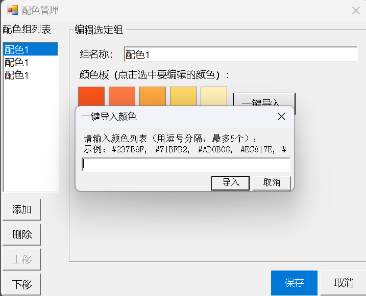

# Visio2Img

A Microsoft Visio add-in for exporting selected shapes to high-quality images.

> 📦 **v1.3.0** | [Download](https://github.com/PandaK404/Visio2Img/releases) | [Changelog](CHANGELOG.md)




## ✨ Features

- ⚡ **Quick Export**: One-click export with default settings
- 🔄 **Repeat Export**: Overwrite last file without re-selecting path
- 🎨 **Color Palette**: Built-in palettes, screen picker, batch import
- 📦 **Batch Export**: Export multiple shapes as individual files
- 🖼️ **Multi-format**: TIFF, PNG, JPEG, EMF, SVG, PDF
- ⌨️ **Shortcuts**: Configurable global hotkeys

## 📥 Quick Install

### Pre-compiled (Recommended)

1. [Download latest release](https://github.com/PandaK404/Visio2Img/releases)
2. Extract and **right-click** `install.bat` → **Run as administrator**
3. Launch Visio and find the **Visio2Img** tab

### Build from Source

```powershell
dotnet build --configuration Release
.\install.bat  # Run as administrator
```

## 📖 Documentation

- [Usage Guide](docs/usage.md) - Detailed features
- [Development Guide](docs/development.md) - Build & debug
- [FAQ](docs/faq.md) - Common questions

## 🎨 Color Resources

Get professional color palettes from [Academic Journal Color Picker](http://lcpmgh.com/colors/) (Science, Nature, etc.) and import them with one click!

## 💻 Requirements

- Windows 10/11 64-bit
- Microsoft Visio 2016+ (64-bit)
- .NET Framework 4.8
- [ImageMagick](https://imagemagick.org/script/download.php) (for PDF export)

## 📜 License

MIT License

---

**Author**: [PandaK404](https://github.com/PandaK404) | Like it? Give a ⭐ Star!
